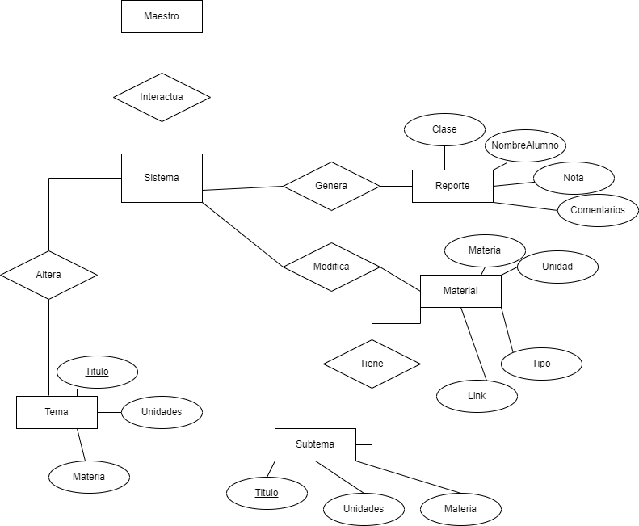
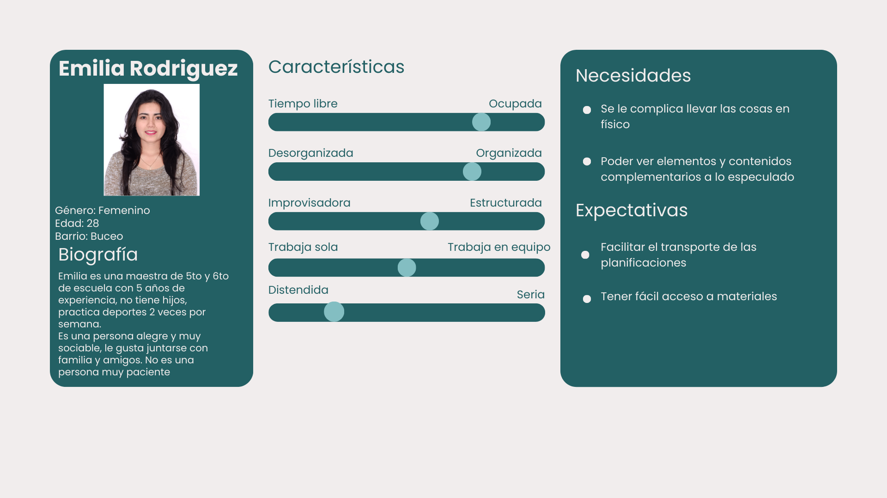
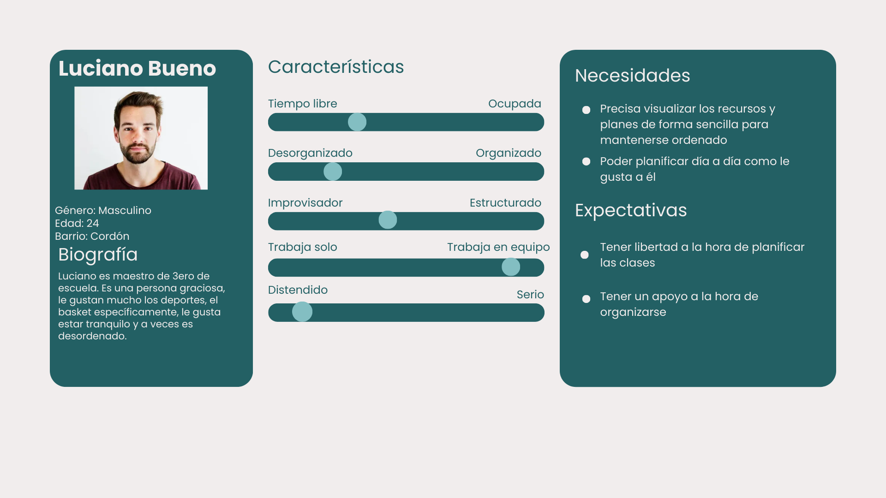
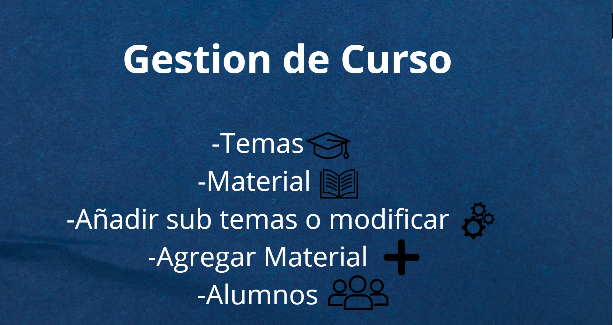
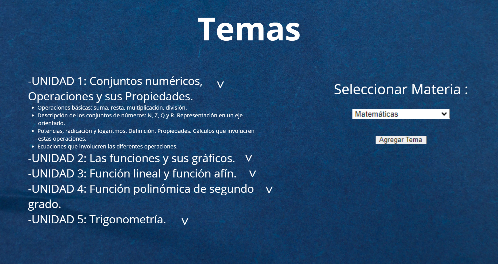
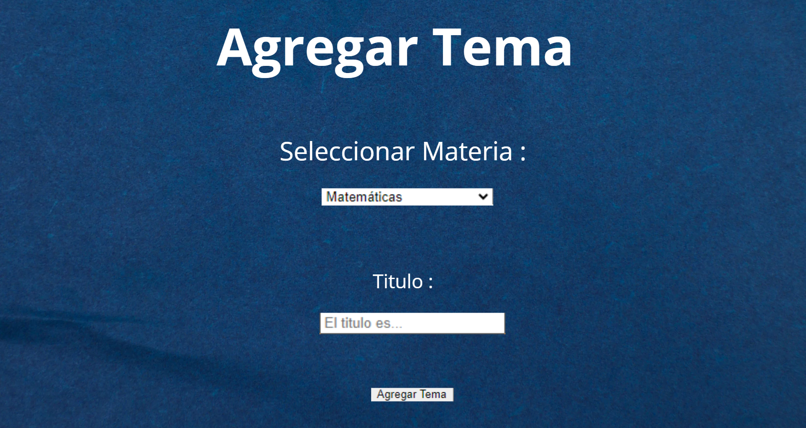
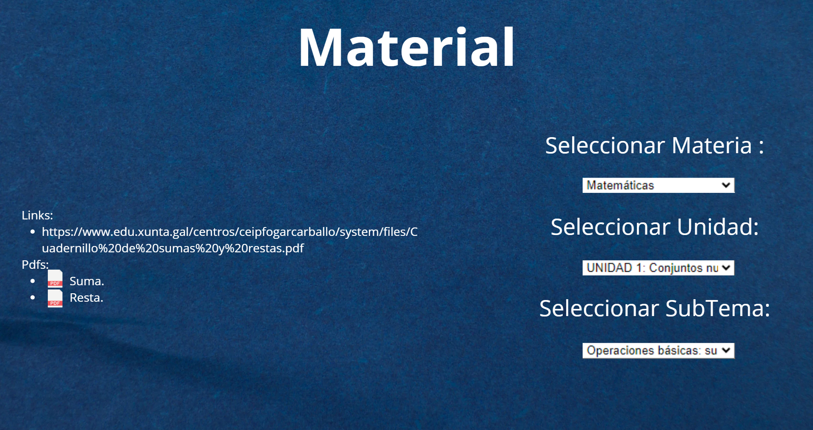
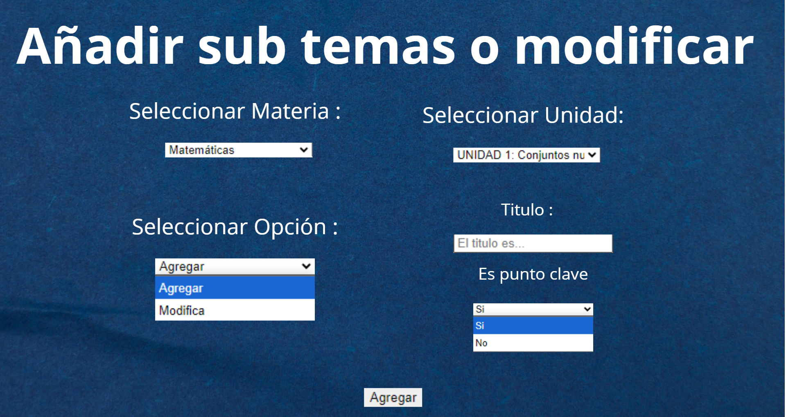
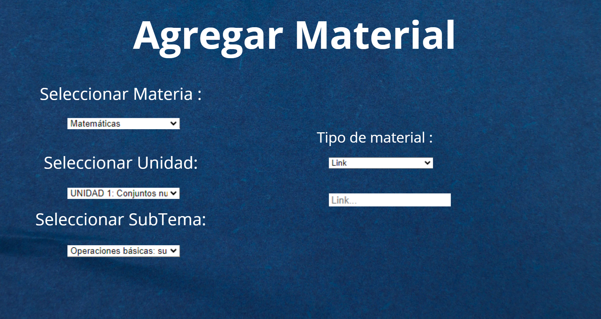
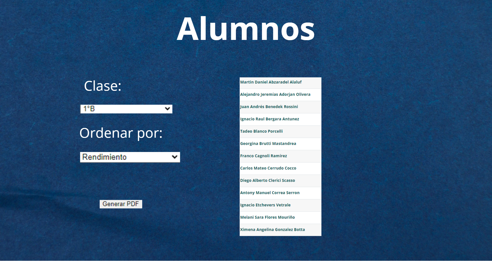

# Informe académico (entrega 1)

## Repositorio Git

Aprendimos de repositorios en clase, y utilizamos lo aprendido para administrar el repositorio otorgado por
el docente para ayudarnos en el progreso de nuestro proyecto.

### Repositorios locales y remotos

Una vez con acceso a los repositorios creamos repositorios locales en nuestras máquinas para asi poder
progresar en paralelo entre nosotros.

### Aplicación de comandos Git

Mayormente utilizamos los comandos de git: "clone", "add", "commit", "push", "pull", "status", "branch", "merge", "checkout".

## Versionado

### Buenas prácticas de versionado

Nuestros commits fueron frecuentes, mensajes descriptivos las mayorias de las veces y utilizamos varias ramas en las cuales cada uno hacia su trabajo por separado, las cuales mergeamos al final de la nueva disposicion de cada trabajo.

### Evolución del proyecto

-Realizar entrevistas
-Analizar problematicas
-Buscar y plantear soluciuones
-Llevar las posibles soluciones y problematicas a user cases/stories
-Realizar boceto IU

## Elicitación

### Evidencia de actividades de investigación

Para recopilar la información necesaria para nosotros poder avanzar en nuestro proyecto, acudimos a 2 formas de elicitación diferente, la primera escuchamos y asistimos a la entrevista hecha a la profesora Patricia por la Ort en el taller. La segunda adquirimos información adicional que ayudo a completar lo adquirido con Patricia, a traves de preguntas de libre a Joaquina.

### Referencias a fuentes de información

-Patricia fue contactada mediante el zoom de taller brindando por los docentes
-Joaquina fue contactada mediante whatsapp

### Caracterización de usuarios

-Patricia tiene 28 años en el rubro
-Joaquina es una docente de nuevo ingreso que no tiene ni un año de experiencia

### Modelo conceptual del problema

## Especificación

### Requerimientos Funcionales y No Funcionales

#### Requerimientos Funcionales

##### RF1: Gestión de Unidades

- **Actor:** Docente
- **Descripción:** Cada docente debe poder agregar las Unidades y contenido.
- **Prioridad:** Alta

---

##### RF2: Gestión de Subtemas

- **Actor:** Docente
- **Descripción:** Cada docente debe poder añadir subtemas y modificar contenido.
- **Prioridad:** Alta

---

##### RF3: Gestión de Materiales Didácticos

- **Actor:** Docente
- **Descripción:** Cada docente debe poder agregar el material con el que trabajará.
- **Prioridad:** Media

---

##### RF4: Modificación de Puntos Clave del Curso

- **Actor:** Docente
- **Descripción:** Cada docente puede agregar y/o modificar puntos vitales para el curso.
- **Prioridad:** Alta

---

##### RF5: Búsqueda de Contenidos

- **Actor:** Docente
- **Descripción:** Los docentes deben poder buscar por contenido específico.
- **Prioridad:** Media

---

##### RF6: Generación de Reportes de Rendimiento Estudiantil

- **Actor:** Sistema
- **Descripción:** El sistema debe generar un documento respecto al rendimiento de cada estudiante.
- **Prioridad:** Alta

---

#### Requerimientos No Funcionales

##### RNF1: Lenguaje

- **Descripción:** El programa debe estar programado en JavaScript.
- **Prioridad:** Media

---

##### RNF2: Legibilidad

- **Descripción:** El código debe ser fácil de leer.
- **Prioridad:** Media

---

##### RNF3: Tipografía

- **Descripción:** El sistema usará una tipografía específica.
- **Prioridad:** Baja

---

##### RNF4: Disponibilidad

- **Descripción:** El programa estará disponible primero en la Play Store.
- **Prioridad:** Baja

### User Stories

#### ID: #1

**Título**: Agregación de sub temas

**Narrativa**:  
Como docente  
Quiero ser capaz de agregar sub temas  
Para modificar la planeación agregando distintos recursos para cubrir las posibles deficiencias de alumno/s

**Criterios de aceptación**:

- Cada tema principal debe poder ser modificado agregando material complementario o refuerzos mediante sub temas

---

#### ID: #2

**Título**: Administración archivo-alumno

**Narrativa**:  
Como docente  
Quiero tener la posibilidad de administrar los archivos de alumnos generados por el sistema  
Agrupándolos según mi parecer

**Criterios de aceptación**:

- Los archivos de alumnos tienen que poder ser administrados por el docente al que el alumno pertenece

---

#### ID: #3

**Título**: Agrupación de clases del docente

**Narrativa**:  
Como docente  
Debo ser capaz de tener distintas planificaciones para cada clase bajo mi responsabilidad

**Criterios de aceptación**:

- Cada clase debe contar con una planificación única y accesible para el docente

### User persona

### Use Cases

#### Título: Agregar Unidad (IU3)

**Actor**: Docente  
**Requisitos asociados**: RF1

| **Acción del Actor**                                | **Respuesta del Sistema**                                                                                                  |
| --------------------------------------------------- | -------------------------------------------------------------------------------------------------------------------------- |
| 1. Selecciona "Materia"                             | 2. Muestra lista de las Materias disponibles                                                                               |
| 3. Indica la Materia que se desea agregar la unidad | 4. Espera a que indique el título para esa unidad                                                                          |
| 5. Escribe el título de la Unidad que desea agregar | 6. Muestra una pestaña confirmando la agregación y asigna el número de la unidad dependiendo de las previamente existentes |

| **Cursos alternativos**:                                                                                                           |
| ---------------------------------------------------------------------------------------------------------------------------------- |
| 2.1 - Lista de Materias vacía: El sistema muestra un mensaje indicando que no hay una materia cargada.                             |
| 5.1 - No se ingresa título para la unidad: Muestra mensaje de advertencia que se necesita un título, no agrega la unidad.          |
| 5.2 - Usuario intenta agregar una Unidad con el nombre ya existente: Mostrar error diciendo que la unidad ya existe, no la agrega. |

---

#### Título: Agregar Subtema (IU5)

**Actor**: Docente  
**Requisitos asociados**: RF2, RF4

| **Acción del Actor**                                          | **Respuesta del Sistema**                                                      |
| ------------------------------------------------------------- | ------------------------------------------------------------------------------ |
| 1. Selecciona "Materia"                                       | 2. Muestra lista de las Materias                                               |
| 3. Indica la Materia que se le quiere dar al subtema          | 4. Muestra Unidades disponibles para esa Materia                               |
| 5. Selecciona a qué Unidad desea agregar el subtema           | 6. Muestra las opciones "Agregar" o "Modificar"                                |
| 7. Selecciona "Agregar"                                       | 8. Espera que se indique un Título para el subtema                             |
| 9. Indica el nombre que le querrá dar al subtema              | 10. Muestra las opciones "Sí" o "No"                                           |
| 11. Selecciona si el subtema es un punto vital del curso o no | 12. Guarda toda la información seleccionada en su respectivo objeto competente |
| 13. Aprieta el botón "Agregar"                                | 14. Aparece una ventana confirmando la agregación                              |

| **Cursos alternativos**:                                                                                                                 |
| ---------------------------------------------------------------------------------------------------------------------------------------- |
| 2.1 - Lista de Materias vacía: El sistema muestra un mensaje indicando que no hay una materia cargada, no deja seguir al siguiente paso. |
| 4.1 - Lista de Unidades vacía: El sistema muestra un mensaje indicando que no hay una Unidad cargada, no deja seguir al siguiente paso.  |
| 9.1 - Usuario intenta agregar un subtema con el nombre ya existente: Mostrar error diciendo que el subtema ya existe, no la agrega.      |
| 9.2 - No se ingresa título para el subtema: Muestra mensaje de advertencia que se necesita un título, no agrega el subtema.              |

---

#### Título: Buscar material de tema (IU4)

**Actor**: Docente  
**Requisitos asociados**: RF5

| **Acción del Actor**                              | **Respuesta del Sistema**                                  |
| ------------------------------------------------- | ---------------------------------------------------------- |
| 1. Selecciona "Materia"                           | 2. Muestra lista de las Materias                           |
| 3. Indica la Materia que se desea ver el material | 4. Muestra Unidades disponibles para esa Materia           |
| 5. Selecciona a qué Unidad desea ver el material  | 6. Muestra los subtemas asociados a la Unidad seleccionada |
| 7. Selecciona el subtema específico               | 8. Muestra los links y PDFs que son parte del subtema      |

| **Cursos alternativos**:                                                                                                                 |
| ---------------------------------------------------------------------------------------------------------------------------------------- |
| 2.1 - Lista de Materias vacía: El sistema muestra un mensaje indicando que no hay una materia cargada, no deja seguir al siguiente paso. |
| 4.1 - Lista de Unidades vacía: El sistema muestra un mensaje indicando que no hay una Unidad cargada, no deja seguir al siguiente paso.  |
| 6.1 - Lista de subtemas vacía: El sistema muestra un mensaje indicando que no hay subtemas cargados, no deja seguir al siguiente paso.   |

---

#### Título: Agregar material (IU6)

**Actor**: Docente  
**Requisitos asociados**: RF3

| **Acción del Actor**                                             | **Respuesta del Sistema**                                     |
| ---------------------------------------------------------------- | ------------------------------------------------------------- |
| 1. Selecciona "Materia"                                          | 2. Muestra lista de las Materias                              |
| 3. Indica la Materia que se le quiere agregar material           | 4. Muestra Unidades disponibles para esa Materia              |
| 5. Selecciona a qué Unidad desea agregar el material             | 6. Muestra los subtemas relacionados a la Unidad seleccionada |
| 7. Selecciona a qué subtema desea vincular el material a agregar | 8. Muestra los tipos de materiales aceptados                  |
| 9. Selecciona "link"                                             | 10. Espera que se indique el link que se desea agregar        |
| 11. Escribe el link que desea agregar                            | 12. Muestra una ventana confirmando la agregación             |

| **Cursos alternativos**:                                                                                                                 |
| ---------------------------------------------------------------------------------------------------------------------------------------- |
| 2.1 - Lista de Materias vacía: El sistema muestra un mensaje indicando que no hay una materia cargada, no deja seguir al siguiente paso. |
| 4.1 - Lista de Unidades vacía: El sistema muestra un mensaje indicando que no hay una Unidad cargada, no deja seguir al siguiente paso.  |
| 6.1 - Lista de subtemas vacía: El sistema muestra un mensaje indicando que no hay subtemas cargados, no deja seguir al siguiente paso.   |
| 11.1 - Link vacío: genera un mensaje de error y no deja seguir.                                                                          |

---

#### Título: Buscar material de tema (IU7)

**Actor**: Docente  
**Requisitos asociados**: RF6

| **Acción del Actor**                            | **Respuesta del Sistema**                                            |
| ----------------------------------------------- | -------------------------------------------------------------------- |
| 1. Selecciona "Clase"                           | 2. Muestra lista de las Clases                                       |
| 3. Indica la Clase que se desea ver los alumnos | 4. Muestra los criterios de orden disponibles para los alumnos       |
| 5. Selecciona por rendimiento académico         | 6. Muestra los alumnos ordenados por su rendimiento de mayor a menor |
| 7. Toca el botón generar PDF                    | 8. Genera PDF en la carpeta previamente indicada por código          |

| **Cursos alternativos**:                                                                                                            |
| ----------------------------------------------------------------------------------------------------------------------------------- |
| 2.1 - Lista de clase vacía: El sistema muestra un mensaje indicando que no hay una clase cargada, no deja seguir al siguiente paso. |

### Bocetos de IU

##### IU 1

##### IU 2

##### IU 3

##### IU 4

##### IU 5

##### IU 6

##### IU 7

## Checkpoint obligatorio 1

Incluir un resumen del avance en elicitación y especificación de requerimientos
Se evaluará de acuerdo al grado de avance

## Validación y verificación

### Verificación

Para realizar la verificación, comprobamos los requerimientos planteados al momento de desarrollar el sistema y, a medida que avanzábamos con el proyecto obligatorio, íbamos marcando el cumplimiento de los mismos. Por lo tanto, llegamos a la conclusión de que construimos el producto correctamente, respetando tanto las buenas prácticas aorendida como cumpliendo con cada uno de los requerimientos y criterios de aprobación.

### Validación

Según el feedback dado por las docentes entrevistadas, estamos construyendo el producto correcto. Gustó mucho nuestra interfaz de usuario intuitiva y fácil de usar. Se comentó que tal vez sería mejor agregar temas y subtemas (IU 3, IU 5), pero no todos los docentes opinaron lo mismo al respecto. A pesar de ello, la conclusión general fue que tanto el producto como el enfoque tomado son los solicitados y que será muy útil para su propósito.

## Reflexión

### Detalle del trabajo individual

Empezamos el proyecto el 30 de septiembre, donde vimos la entrevista dada por la ORT en aulas, y nuestra propia entrevista con una maestra de primaria. Joaquin se encargo del titulo "Repositorio Git",
mientras que Santiago se encargo del titulo "Elicitacion" para llegar al primer checkpoint. Luego el 20 de Octubre seguimos lo que faltaba, Joaquin encargandose de los User stories y requerimientos, Santiago por el otro lado hizo los User cases, requerimientos y
el diseño UI, Martin se encargo de los User Persona y el Modelo Conceptual del problema.

### Técnicas aplicadas y aprendizajes

#### Técnicas aplicadas

Para este trabajo se aplicaron diferentes técnicas de diversos temas tratados en clase, tanto las técnicas de buen versionado en Git como las de elicitación, mediante entrevistas y análisis de documentos. Las entrevistas se realizaron con preguntas de libre contexto, lo cual dio más libertad para la expresión de los docentes y facilitó la obtención de los requerimientos. También se utilizaron los formatos proporcionados para realizar tanto los user stories como los use cases, así como los componentes correctos al momento de desarrollar la interfaz de usuario.

##### Reflexión Santiago

Luego de realizar este trabajo noté lo beneficioso que Git puede ser para que varias personas trabajen en un mismo proyecto a la vez. Por otro lado, respecto al tema tratado en el mismo, pudimos aprender las grandes diferencias que puede haber entre diferentes docentes, así como sus necesidades, aunque a pesar de esto comparten muchas necesidades respecto a los cursos que dictan. Creo que el proyecto presentado puede ser de gran ayuda para el área específica diseñada.

##### Reflexión Joaquin

Este proyecto me hizo apreciar lo bueno y conveniente que es Git y Github a la hora de trabajar con otras personas en un mismo proyecto, mas en si cuando hablamos de el trabajo en paralelo que este permite con sus ramas y versiones. Hablando mas en enfasis con el material del proyecto, yo creo que lo dado fue un muy buen ejemplo de como reconocer un problema que ocurre en el presente, y poder afrontarlo de a poco, reconociendo todos sus detalles para en un futuro afrontarlo de a poco y asi estar mas organizados al momento de hacerlo en su totalidad.

##### Reflexión Martin

Durante el obligatorio pude abrir la cabeza y entender ideas generales de como desarrollar un proyecto, con lo que conlleva. A su vez fue una oportunidad para aprender la practicidad de herramientas como Git y Github, con sus comandos, los cuales facilitan de manera significativa el trabajo en equipo. También este proyecto me mostró como hay oportunidades en lugares que uno da por hecho, como lo es por ejemplo la planificación de los maestros y todo su trabajo.
